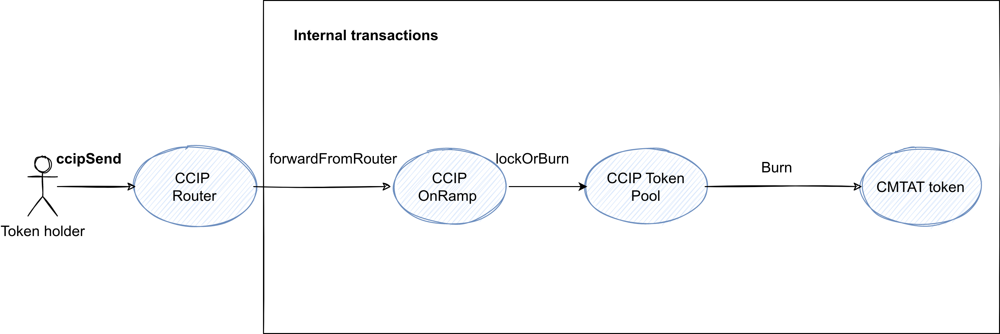
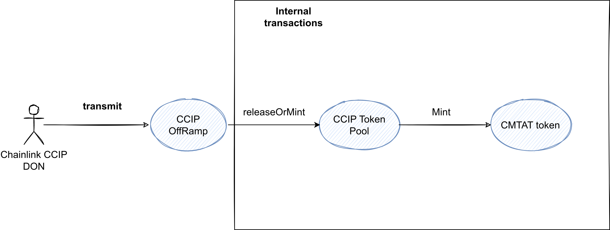

> This repository has been modified and simplified from the [Chainlink examples repository](https://github.com/smartcontractkit/smart-contract-examples). 
>
> This repository contains a collection of Foundry scripts designed to simplify and show deployment of a [CMTAT token](https://github.com/CMTA/CMTAT) with CCIP contracts.
>
> Find a list of available tutorials on the Chainlink documentation: [Cross-Chain Token (CCT) Tutorials](http://docs.chain.link/ccip/tutorials/cross-chain-tokens#overview).
>
> See also [ccip-cct-starter](https://github.com/Cyfrin/ccip-cct-starter)
>
> This project has not undergone an audit and is provided as-is without any warranties.

### Technical Specifications

- Deploy a [CMTAT](https://github.com/CMTA/CMTAT) token on two testnet blockchains (e.g., Sepolia and Avalanche Fuji).
- Bridge tokens between them using [Chainlink CCIP](https://docs.chain.link/ccip).
- The CMTAT token already implements the [Cross-Chain Token standard](https://docs.chain.link/ccip/concepts/cross-chain-token).
- Provide guidelines and details for the main steps involved.

### Repository Preparation

**Note:** The default project layout in `foundry.toml` has been overridden to `src = "lib/cmta/contracts"`. To build the project, follow these steps:

1.  Clone the repository.
2.  Run `forge install` and `npm install`.
3.  Navigate to the `lib/cmta` directory and run `npm install` and `git submodule update`.
4.  Run `forge build`.

### Prerequisites

This guide assumes you are already familiar with Solidity, Foundry, and Chainlink CCIP. You should also have native tokens (e.g., ETH on Sepolia and AVAX on Fuji) and LINK tokens on both chains.

### Main Steps

0.  **Optional:** Start local Anvil servers for both chains: `npm run start-anvil:sepolia` and `npm run start-anvil:fuji`.
1.  Deploy the token on both chains: `npm run exec:broadcast -- deploy:token <sepolia/fuji>`
2.  Deploy the token pool on both chains: `npm run exec:broadcast -- deploy:token-pool <sepolia|fuji>`
3.  Claim the admin role on both chains: `npm run exec:broadcast -- claim-admin <sepolia|fuji>`
4.  Accept the admin role on both chains: `npm run exec:broadcast -- accept-admin <sepolia|fuji>`
5.  Set the token pool on both chains: `npm run exec:broadcast -- set-token-pool <sepolia|fuji>`
6.  Apply chain updates on both chains: `npm run exec:broadcast -- apply-chain-updates <sepolia|fuji> <destinationChainSelector>`
7.  Mint tokens on a chain: `npm run exec:broadcast -- mint <sepolia|fuji> <amount>`
8.  Transfer tokens between chains: `npm run exec:broadcast -- transfer <sepolia|fuji> <amount> <native|link> <destinationChainSelector>`

### Quick Overview of Each Step

0.  Before broadcasting any transactions, it is a best practice to run the scripts locally to ensure everything works as expected. You can start two forked Anvil servers (one for Sepolia and one for Fuji) for local testing.
1.  First, deploy the `CMTATStandalone` token contract on both chains. We use this version because it includes the `getCCIPAdmin` function, which simplifies the admin claiming process.
2.  After deploying the token, deploy the `BurnMintTokenPool` contract on both chains.
3.  On CMTAT, set the CCIP admin address
4.  Claim the admin role for the token pool. This will allow you to configure the necessary settings for bridging.
5.  Complete the process by accepting the admin role.
6.  Wire up the token pool to the token contract by setting the pool address on the token contract.
7.  Link the chains by applying the chain updates on both token pools.
8.  On CMTAT, grant the minter role to the pool contract
9.  Mint new tokens to an address.
10.  Bridge the tokens from a source chain to a destination chain.
     - Approve the router contract to spend tokens on your behalf
     - Call `ccipSender`on the router contract

**Note**

Some steps are interchangeable, others must be done in order. For example, the CCIP admin role must be set in the CMTAT before the admin role can be claimed on the token registry contract.

### Artifacts

- [Deployments](./script/output)
- [Sepolia to Fuji Transfer](https://ccip.chain.link/#/side-drawer/msg/bea53245339f8907c2104a11ded786428980968a1a639cd1d87d9ae464683f31) | [Fuji to Sepolia Transfer](https://ccip.chain.link/#/side-drawer/msg/dfb374fef50749b0bc86784e097ecc9547c5145ddfb8f9d96f1da3024abfcd04)

#### Example

Transfer from Fuji to Sepolia

##### Contract

Here the list of contracts called

|                      | Avalanche Fuji Address                                       | Deploy         |
| -------------------- | ------------------------------------------------------------ | -------------- |
| CMTAT                | [0x0eB9B06137B6087D0e9423203473f9e0B58D59Ea](https://testnet.snowtrace.io/address/0x0eB9B06137B6087D0e9423203473f9e0B58D59Ea) | CMTAT deployer |
| Pool contract        | [0xD83909F43D934fbDC3D62d91285B518009c8d7Ee](https://testnet.snowtrace.io/address/0xD83909F43D934fbDC3D62d91285B518009c8d7Ee) | CMTAT deployer |
| Token Admin registry | [0xA92053a4a3922084d992fD2835bdBa4caC6877e6](https://testnet.snowtrace.io/address/0xA92053a4a3922084d992fD2835bdBa4caC6877e6) | Chainlink      |
| Router               | [0xF694E193200268f9a4868e4Aa017A0118C9a8177](https://testnet.snowtrace.io/address/0xF694E193200268f9a4868e4Aa017A0118C9a8177) | Chainlink      |

##### Step

| Step                                   | Description                                                  | Target contract    | Function                                                     | Script                          | Note                              | Transaction [Avalanche Fuji]                            |
| -------------------------------------- | ------------------------------------------------------------ | ------------------ | ------------------------------------------------------------ | ------------------------------- | --------------------------------- | ------------------------------------------------------------ |
| **Deployment**                         |                                                              |                    |                                                              |                                 |                                   |                                                              |
| 1                                      | Deploy CMTAT token                                           | -                  | -                                                            | `DeployToken.s.sol`             | -                                 | [https://testnet.snowtrace.io/tx/0xaa1f8ecad4e21bd1563a8ed56b4d7f4026b0a1ba52331c88cd04f91fcd89634a?chainid=43113](https://testnet.snowtrace.io/tx/0xaa1f8ecad4e21bd1563a8ed56b4d7f4026b0a1ba52331c88cd04f91fcd89634a?chainid=43113) |
| 2                                      | Deploy CCIP pool (e.g. BurnMintTokenPool)                    | -                  | -                                                            | `DeployBurnMintTokenPool.s.sol` | -                                 | [https://testnet.snowtrace.io/tx/0xbca532f461ad1248ca1bf8d8a417c4bc4a19625b7dfbf6f9a9e5e15197e3f755?chainid=43113](https://testnet.snowtrace.io/tx/0xbca532f461ad1248ca1bf8d8a417c4bc4a19625b7dfbf6f9a9e5e15197e3f755?chainid=43113) |
| **CMTAT configuration**                |                                                              |                    |                                                              |                                 |                                   |                                                              |
| 3                                      | Set the CCIP admin                                           | CMTAT              | `setCCIPAdmin(address newAdmin)`                             | `DeployToken.s.sol`             | -                                 | [https://testnet.snowtrace.io/tx/0xd3ff7e6e899c2deaa27b4a4a0bf14b5d47f5420df1f85c59eb9af0ff13c22f93?chainid=43113](https://testnet.snowtrace.io/tx/0xd3ff7e6e899c2deaa27b4a4a0bf14b5d47f5420df1f85c59eb9af0ff13c22f93?chainid=43113) |
| **Token Admin Registry configuration** |                                                              |                    |                                                              |                                 |                                   |                                                              |
| 4                                      | Claim the admin role on both chains                          | TokenAdminRegistry | `registerAdminViaGetCCIPAdmin(address token)`                | `ClaimAdmin.s.sol`              | -                                 | [https://testnet.snowtrace.io/tx/0x66f921c979c2ed5d3bafeffbfbb9c9d317941289b6587a35f4b2f24e649c8f22?chainid=43113](https://testnet.snowtrace.io/tx/0x66f921c979c2ed5d3bafeffbfbb9c9d317941289b6587a35f4b2f24e649c8f22?chainid=43113) |
| 5                                      | Accept the admin role on both chains                         | TokenAdminRegistry | `acceptAdminRole(address localToken)`                        | `AcceptAdminRole.s.sol`         | -                                 | [https://testnet.snowtrace.io/tx/0xbb5eb3cfe5cc4ab3183bfe3eb4336c0201ee6734b87955662f0b391989e94120?chainid=43113](https://testnet.snowtrace.io/tx/0xbb5eb3cfe5cc4ab3183bfe3eb4336c0201ee6734b87955662f0b391989e94120?chainid=43113) |
| 6                                      | Set Token Pool on both chain                                 | TokenAdminRegistry | `setPool(address localToken, address pool)`                  | `SetPool.s.sol`                 | `localToken` is the CMTAT address | [https://testnet.snowtrace.io/address/0xA92053a4a3922084d992fD2835bdBa4caC6877e6](https://testnet.snowtrace.io/address/0xA92053a4a3922084d992fD2835bdBa4caC6877e6) |
| **Pool configuration**                 |                                                              |                    |                                                              |                                 |                                   |                                                              |
| 7                                      | Apply chain updates on both chains / configure supported blockchain | BurnMintTokenPool  | `applyChainUpdates(uint64[] remoteChainSelectorsToRemove, (uint64 remoteChainSelector, bytes[] remotePoolAddresses, bytes remoteTokenAddress, (bool isEnabled, uint128 capacity, uint128 rate) outboundRateLimiterConfig, (bool isEnabled, uint128 capacity, uint128 rate) inboundRateLimiterConfig)[] chainsToAdd)` | `ApplyChainUpdates.s.sol`       | -                                 | [https://testnet.snowtrace.io/tx/0x267ce681ebefc2895a7d5d0c0d8437a8206ad00d3752559b1710c4e084341cd4?chainid=43113](https://testnet.snowtrace.io/tx/0x267ce681ebefc2895a7d5d0c0d8437a8206ad00d3752559b1710c4e084341cd4?chainid=43113) |
| **CMTAT configuration**                |                                                              |                    |                                                              |                                 |                                   |                                                              |
| 8                                      | Grant the minter role to the CCIP pool                       | CMTAT              | `grantRole(bytes32 role, address account)`                   | -                               | `account`is the CCIP pool address | [https://testnet.snowtrace.io/tx/0xd5e543bfce1f00d76dc15b6fab670e04bd46435b1b2b9ad59854e3061df89b3d?chainid=43113](https://testnet.snowtrace.io/tx/0xd5e543bfce1f00d76dc15b6fab670e04bd46435b1b2b9ad59854e3061df89b3d?chainid=43113) |
| 9                                      | Mint new tokens                                              | CMTAT              | `mint(address account, uint256 value)`                       | `MintTokens.s.sol`              | -                                 | [https://testnet.snowtrace.io/tx/0xacc1858294c5cbfda83f034ecb60d4911584413dcd0c3ff379421d3086ef0df0?chainid=43113](https://testnet.snowtrace.io/tx/0xacc1858294c5cbfda83f034ecb60d4911584413dcd0c3ff379421d3086ef0df0?chainid=43113) |
| **Cross-chain Transfer**               |                                                              |                    |                                                              |                                 |                                   |                                                              |
| 10                                     | Approve router to spend token on your behalf                 | CMTAT              | ERC-20 `approve(address spender, uint256 value)`        | `TransferTokens.s.sol`          | `spender`is the CCIP pool         | [https://testnet.snowtrace.io/tx/0x625c683b1946cef2db3a30001325846f04bbacaeed76cb177f7a283c9410f774?chainid=43113](https://testnet.snowtrace.io/tx/0x625c683b1946cef2db3a30001325846f04bbacaeed76cb177f7a283c9410f774?chainid=43113) |
| 11                                     | Transfer tokens by calling `ccipSend`on the router contract  | router             | `ccipSend(uint64 destinationChainSelector, (bytes receiver, bytes data, (address token, uint256 amount)[] tokenAmounts, address feeToken, bytes extraArgs) message) payable returns (bytes32)` | `TransferTokens.s.sol`          | -                                 | [https://testnet.snowtrace.io/tx/0x7d9458696b9e0e7c67072bd2cc6802226f05316f216fcec88a39c2322359734d?chainid=43113](https://testnet.snowtrace.io/tx/0x7d9458696b9e0e7c67072bd2cc6802226f05316f216fcec88a39c2322359734d?chainid=43113) https://sepolia.etherscan.io/tx/0x43e500140c7331b03373318c45b85cb8defca51f13b32861f5b03b54c4b7963b |

##### Schema

Here is a schema explaining the transfer from the source chain:

And on the destination chain

You can find more information on the process on the [chainlink documentation](https://docs.chain.link/ccip)

### Additional Resources

A detailed bridging tutorial from Chainlink can be found [here](./GUIDELINE.md).
